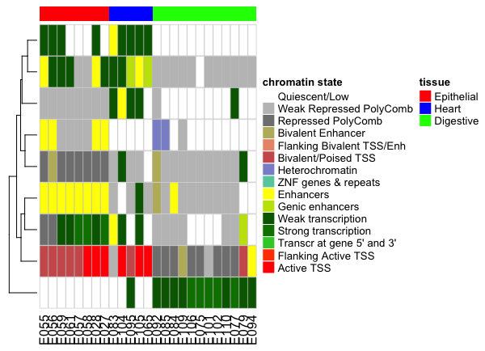

### Random Forest

Lisa has suggested to use Random Forest to select the features for testing.

```{r}

library(dplyr)
library(rlang)
library(caret)

seg_df_sub<- read.table("data/epigenome_Roadmap/merged_segments/seg_df_chr1_sub.tsv", stringsAsFactors = F, sep = "\t", header =T)

meta_data<- read.table("data/epigenome_Roadmap/ids_with_rnaseq.tsv", stringsAsFactors = F, sep = "\t", header =T)

## need to figure out a better way to select the columns...
new_data<- seg_df_sub %>% distinct(E027, E028, E055, E056, E057, E058, E059, E061, E065, E075, E077, E079, E083, E084, E085, E092, E094, E095, E101, E102, E104, E105, E106, E109, E110, .keep_all = T)

x_data<- as.matrix(new_data[-c(1:3,ncol(new_data))])

rownames(x_data)<- paste(new_data$chr, new_data$start, new_data$end, sep = ":")

## transpose the matrix.
x_data<- t(x_data)

## random forest does not like matrix if it is not numeric. turn back to a dataframe
x_data<- data.frame(x_data)

resp_data<- merge(x = data.frame(Sample = rownames(x_data)), y = meta_data, by.x = "Sample", by.y = "X1", all.x = T, all.y = F)

resp_data$X2 = factor(resp_data$X2, levels = c("Epithelial", "Digestive", "Heart"))

sub_meta = subset(meta_data, X2 %in% c("Heart", "Digestive", "Epithelial"))
names(sub_meta)<- c("sample", "tissue", "rna_seq")

library(readr)
write_tsv(sub_meta[, c(1,2)] %>% mutate(sample = paste0(sample, ".bed.bgz")), "data/epigenome_Roadmap/sample_info.txt")

sample_ids = subset(meta_data, X2 %in% c("Heart", "Digestive", "Epithelial"))$X1

set.seed(1973)
cols2use = sample(1:ncol(x_data), 200)

data<- cbind(x_data, tissue = resp_data$X2)

## caret package https://machinelearningmastery.com/feature-selection-with-the-caret-r-package/


## create dummy variables, caret assumes the predictors to be numeric. takes forever...
dummies <- dummyVars( tissue ~ .,  data = data)
head(predict(dummies, newdata = etitanic))


control <- rfeControl(functions=rfFuncs, method="cv", number=10)
# run the RFE algorithm
results <- rfe(x_data, resp_data$X2, sizes=c(1:8), rfeControl=control)
# summarize the results
print(results)
# list the chosen features
predictors(results)
# plot the results
plot(results, type=c("g", "o"))


####
rf_mod = randomForest(x = x_data[,cols2use], y = resp_data$X2)
getTree(rf_mod)
# default ntree= 500,
getTree(rf_mod, labelVar =T, k=1)
getTree(rf_mod, labelVar =T, k=2)
```


### only use a subset of features to test.

I googled around and found [`VSURF`](https://cran.r-project.org/web/packages/VSURF/index.html) package to do feature selections using randomForest. Paper describing the package https://github.com/crazyhottommy/Epigenome_RoadTrip/blob/master/papers/VSURF_paper.pdf

```{r}
library(VSURF)

test_data<- x_data[,cols2use]

ti<- proc.time()
vsurf <- VSURF(x = x_data[,cols2use], y = resp_data$X2, ntree = 500, parallel =F)
proc.time() - ti

names(vsurf)
summary(vsurf)

plot(vsurf)
vsurf$varselect.thres
vsurf$varselect.interp
vsurf$varselect.pred

```

The running time of using all 440 k features can be very long. Lisa is testing on the server.

at the same time, even from those random 200 features, 7 are selected out as important ones. And I checked on IGV. some look
good to me to differentiate the subgroups.

```{r}
> vsurf$varselect.pred
[1] 160 155 153

colnames(test_data)[vsurf$varselect.pred]
[1] "chr1.94106400.94106600"   "chr1.200879400.200879800" "chr1.19945600.19945800"

```

### Think about using heatmap to visualize all features


### Heatmap

```{r}
library(stringr)
library(ComplexHeatmap)
colnames(test_data)[vsurf$varselect.interp]

rf_mat<- test_data[vsurf$varselect.interp]
#rf_mat<- test_data[vsurf$varselect.thres]

sub_meta

# reorder the mat according to the meta data

rf_mat<- rf_mat[sub_meta$sample, ]
Heatmap(t(rf_mat), show_row_names = F)

## one can change it to numeric and cluster with eucledian distance
rf_numeric_mat<- as.data.frame(rf_mat) %>%
        mutate_all(str_replace, "E", "") %>%
        mutate_all(as.numeric) %>%
        as.matrix()

rownames(rf_numeric_mat)<- rownames(rf_mat)


cell_fun = function(j, i, x, y, width, height, fill) {
	grid.rect(x = x, y = y, width = width *0.98, height = height *0.98,
		gp = gpar(col = "grey", fill = fill, lty = 1, lwd = 0.5))
}

## get colors http://wiki.wubrowse.org/QuantitativeCategorySeries
col_fun<- circlize::colorRamp2(1:15, c('#ff0000', '#ff4500', '#32cd32','#008000','#006400',
                                       '#c2e105', '#ffff00', '#66cdaa', '#8a91d0', '#cd5c5c',
                                       '#e9967a', '#bdb76b', '#808080', '#c0c0c0', '#ffffff'))

df<- sub_meta[,2, drop =F]
rownames(df)<- sub_meta$sample

ha<-  HeatmapAnnotation(df = df, col = list(tissue = c("Epithelial" =  "red", "Heart" = "blue",
                                                       "Digestive" = "green")))

Heatmap(t(rf_numeric_mat), show_row_names = F,
        rect_gp = gpar(type = "none"),
        cell_fun = cell_fun, col = col_fun,
        cluster_columns = F,
        heatmap_legend_param = list(color_bar = "discrete", at = 1:15,
                                    labels = c('Active TSS', 'Flanking Active TSS',
                                               'Transcr at gene 5\' and 3\'', 'Strong transcription',
                                               'Weak transcription', 'Genic enhancers',
                                               'Enhancers', 'ZNF genes & repeats',
                                               'Heterochromatin', 'Bivalent/Poised TSS',
                                               'Flanking Bivalent TSS/Enh','Bivalent Enhancer',
                                               'Repressed PolyComb', 'Weak Repressed PolyComb',
                                               'Quiescent/Low')),
        name = "chromatin state",
        top_annotation = ha)

## no lines between grid
Heatmap(t(rf_numeric_mat), show_row_names = F,
        cluster_columns = T,
        col = col_fun,
        heatmap_legend_param = list(color_bar = "discrete", at = 1:15,
                                    labels = c('Active TSS', 'Flanking Active TSS',
                                               'Transcr at gene 5\' and 3\'', 'Strong transcription',
                                               'Weak transcription', 'Genic enhancers',
                                               'Enhancers', 'ZNF genes & repeats',
                                               'Heterochromatin', 'Bivalent/Poised TSS',
                                               'Flanking Bivalent TSS/Enh','Bivalent Enhancer',
                                               'Repressed PolyComb', 'Weak Repressed PolyComb',
                                               'Quiescent/Low')),
        name = "chromatin state",
        top_annotation = ha)
```

seems like promising even only 500 features are used to test.


